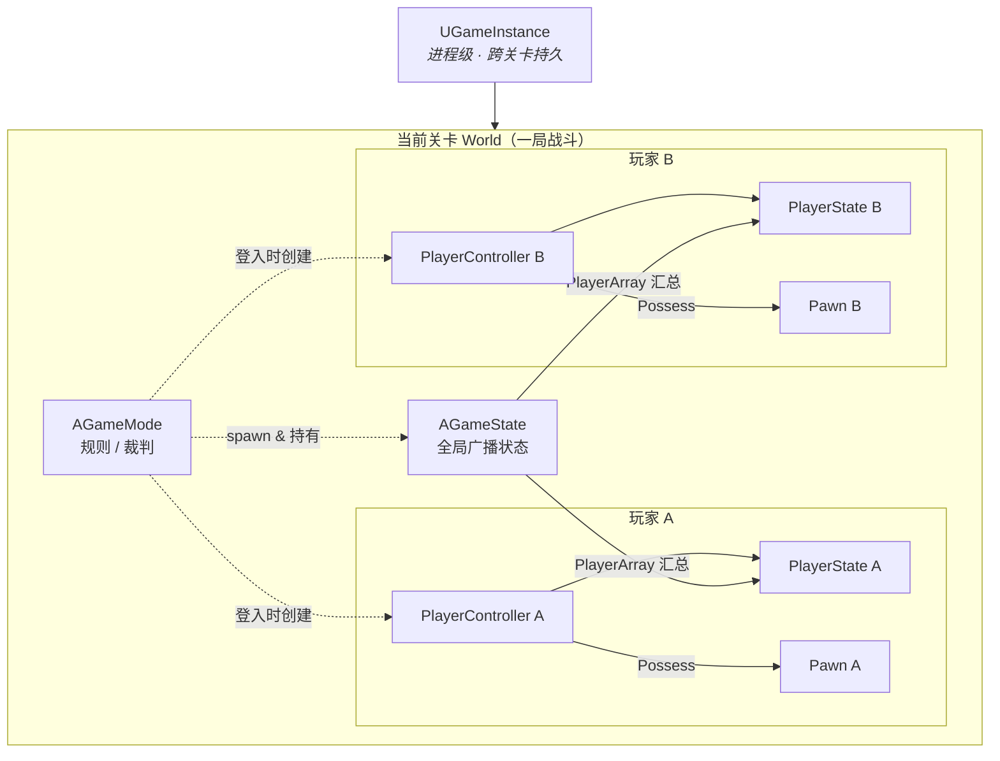
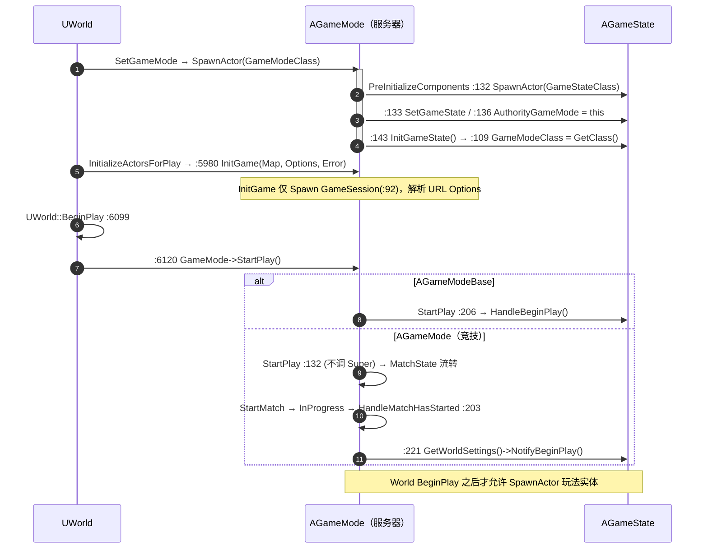
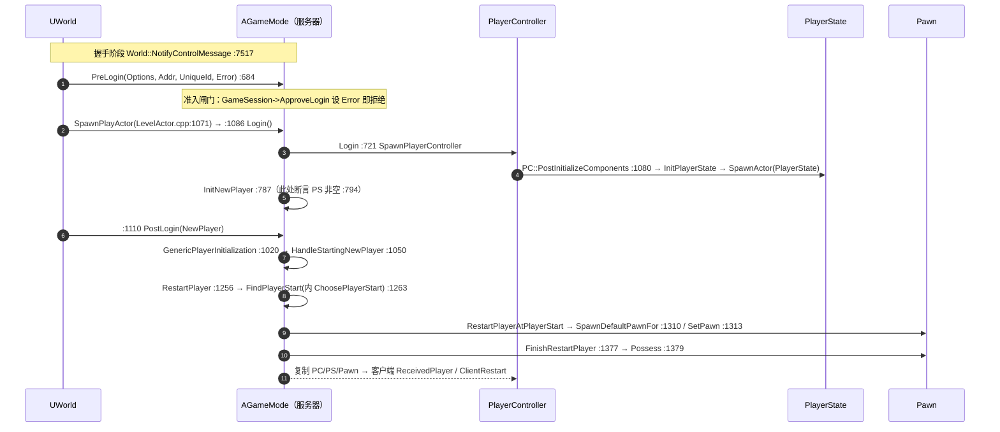
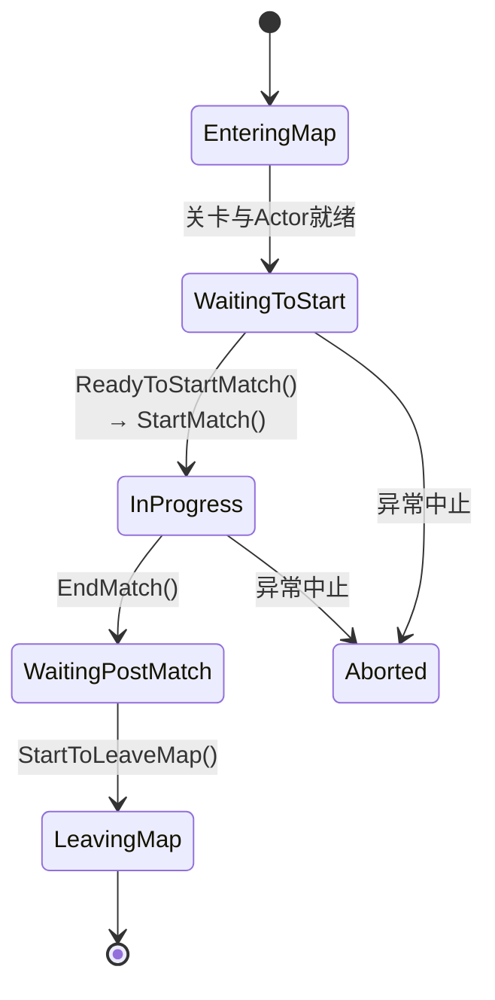
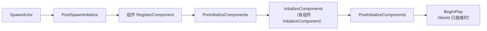

# DS 中 GameMode / GameState / PlayerController / PlayerState 深入解析

> 目标引擎：UE 5.x ｜ 网络模式：Dedicated Server + Client
> 核心基类：`AGameModeBase` / `AGameStateBase` / `APlayerController` / `APlayerState`
> 文中函数调用行号取自 UE 引擎公开源码（`GameModeBase.cpp` / `GameMode.cpp` / `PlayerController.cpp` / `PlayerState.cpp` / `Controller.cpp` / `LevelActor.cpp` / `World.cpp`），仅供定位参考，具体以所用引擎版本为准。

## 目录

- [DS 中 GameMode / GameState / PlayerController / PlayerState 深入解析](#ds-中-gamemode--gamestate--playercontroller--playerstate-深入解析)
  - [目录](#目录)
  - [1. 核心概念：四类的定位与协作](#1-核心概念四类的定位与协作)
  - [2. 网络存在性：谁在服务器、谁在客户端](#2-网络存在性谁在服务器谁在客户端)
  - [3. 逐类深入职责剖析](#3-逐类深入职责剖析)
    - [AGameModeBase vs AGameMode](#agamemodebase-vs-agamemode)
    - [AGameStateBase / AGameState —— 状态广播中枢](#agamestatebase--agamestate--状态广播中枢)
    - [APlayerController —— 所有权与 RPC 枢纽](#aplayercontroller--所有权与-rpc-枢纽)
    - [APlayerState —— 跨端玩家名片](#aplayerstate--跨端玩家名片)
  - [4. 战场启动：关卡级初始化时序](#4-战场启动关卡级初始化时序)
    - [关键阶段说明（按真实执行先后）](#关键阶段说明按真实执行先后)
  - [5. 玩家登入：PreLogin → Login → PostLogin](#5-玩家登入prelogin--login--postlogin)
    - [三个关键钩子的边界](#三个关键钩子的边界)
    - [属主客户端侧的回响](#属主客户端侧的回响)
  - [6. MatchState 比赛状态机（AGameMode 专有）](#6-matchstate-比赛状态机agamemode-专有)
  - [7. Actor 通用初始化生命周期](#7-actor-通用初始化生命周期)
  - [8. 无缝旅行（Seamless Travel）对初始化的影响](#8-无缝旅行seamless-travel对初始化的影响)
  - [9. 重点挖掘：陷阱与最佳实践](#9-重点挖掘陷阱与最佳实践)
    - [GAS 组件的挂载时机差异](#gas-组件的挂载时机差异)

---

## 1. 核心概念：四类的定位与协作

Unreal 的 Gameplay Framework 用一组分工明确的类来承载「一局游戏」的规则、状态与玩家。理解它们最有效的角度不是「它们是什么」，而是 **「它们存在于哪台机器、复制给谁」**——这是 DS 架构下一切初始化时序与数据可见性问题的根源。

| 类 | 比喻 | 作用域 / 生命周期 | 核心职责 |
|---|---|---|---|
| `UGameInstance` | 整个应用 | 进程级，跨关卡持久 | 贯穿整个进程的全局管理器，切图不销毁。承载子系统（Subsystem）、会话、登录态。 |
| `AGameModeBase` / `AGameMode` | 裁判 / 规则书 | 单关卡，**仅服务器** | 定义规则：谁能进、出生点、Pawn 类、胜负条件、比赛状态流转。 |
| `AGameStateBase` / `AGameState` | 记分牌 / 公告栏 | 单关卡，**全端复制** | GameMode 想让所有客户端看到的全局状态：比分、比赛阶段、玩家列表、服务器时间。 |
| `APlayerController` | 玩家的意志 | 单玩家，Server + 属主端 | 把「人的输入」转成「游戏中的指令」，是玩家与服务器之间的 RPC 通道与所有权锚点。 |
| `APlayerState` | 玩家的名片 | 单玩家，**全端复制** | 需要被所有人看到的玩家数据：名字、分数、队伍、Ping。是跨端玩家信息的唯一可靠载体。 |
| `APawn` / `ACharacter` | 玩家的化身 | 被 PC 占有（Possess） | 世界中的物理实体，可被销毁/重生，与 PlayerController 解耦。 |

> **一句话记忆**：GameMode 是只有服务器知道的规则；GameState 是服务器广播给所有人的公告；PlayerController 是每个人手里的遥控器；PlayerState 是贴在每个人身上、所有人都能看到的名牌。

四类在一局战斗中的持有与协作关系：



---

## 2. 网络存在性：谁在服务器、谁在客户端

这是 DS 开发中 **最容易踩坑、也最重要** 的一张表。在专用服务器上不存在「本地玩家」，服务器是纯粹的权威仲裁者；每个客户端只能看到复制过来的一小部分世界。

图例：🟡 仅服务器 ｜ 🟢 服务器 + 所有客户端（复制）｜ 🔵 服务器 + 属主客户端

| 类 | 存在位置 | 是否复制 | 数量关系 | 关键含义 |
|---|---|---|---|---|
| `AGameMode` | 🟡 仅 SERVER | 否 | 每 World 一个 | 客户端上 `GetAuthGameMode()` 永远返回 `nullptr`。规则逻辑绝不能依赖客户端能读到它。 |
| `AGameState` | 🟢 SERVER + ALL | 是 | 每 World 一个 | GameMode 与客户端之间的「广播窗口」。客户端读全局状态只能通过它。 |
| `APlayerController` | 🔵 SERVER + 属主端 | 特殊 | 每玩家一个 | 服务器持有**全部** PC；每个客户端**只拥有自己那一个**，看不到别人的 PC。 |
| `APlayerState` | 🟢 SERVER + ALL | 是 | 每玩家一个 | 所有玩家的 PlayerState 复制到所有客户端。想让别人看到我的名字/队伍/分数，只能放这里。 |
| `APawn` | 🟢 SERVER + ALL* | 是（受相关性影响） | 视玩法而定 | 受网络相关性（Relevancy）/剔除距离影响，远处的 Pawn 可能不复制到某客户端。 |

> **核心推论**：在 DS 上，**客户端看不到 GameMode，也看不到其他玩家的 PlayerController**。因此：① 全局状态放 `GameState`；② 跨端玩家信息放 `PlayerState`（并通过 `GameState::PlayerArray` 遍历）；③ 玩家私有的、需下发到属主端的指令走 `PlayerController` 的 `Client_` RPC。

---

## 3. 逐类深入职责剖析

### AGameModeBase vs AGameMode

UE4.14 起框架拆成两层，务必分清：

- **`AGameModeBase`**：精简基类。只有登入/登出、Pawn 生成、出生点选择等最小规则集。适合单人、休闲、菜单关卡。
- **`AGameMode`**：继承 Base，额外引入 **MatchState 比赛状态机**（`WaitingToStart → InProgress → WaitingPostMatch`）、`bDelayedStart`、比赛开始/结束的显式控制。**多人竞技 / 对战类 DS 几乎都应基于 `AGameMode`**，因为你需要「所有人就位后统一开赛」这类语义。

### AGameStateBase / AGameState —— 状态广播中枢

GameState 是 GameMode 在客户端的「代言人」。GameMode 在 `InitGameState()` 中写入反向引用（注意：GameState 对象本身更早在 `PreInitializeComponents` 中 SpawnActor，见第 4 节）：

```cpp
// AGameModeBase::InitGameState() 内部（简化）
GameState->GameModeClass = GetClass();
GameState->SpectatorClass = SpectatorClass;
GameState->ReceivedGameModeClass();
// 而 AuthorityGameMode / GameState 的 SpawnActor 发生在更早的 PreInitializeComponents
```

关键成员：`PlayerArray`（所有 PlayerState 的汇总，客户端遍历玩家的唯一入口）、`GetServerWorldTimeSeconds()`（网络同步的权威时间）、`bReplicatedHasBegunPlay`（比赛是否已 BeginPlay 的复制标志）。

### APlayerController —— 所有权与 RPC 枢纽

- **所有权锚点**：一个 Actor 的 `Owner` 链最终指向某个 PlayerController，才决定它的 RPC 走哪条连接、以及 `COND_OwnerOnly` 复制条件。
- **输入 → 指令**：客户端采集输入，通过 `Server_` RPC 上报服务器仲裁。
- **持有 PlayerState 与 Pawn**：`PlayerState` 在 PC 初始化时创建；`Pawn` 通过 `Possess()` 关联，二者生命周期解耦（Pawn 死亡重生，PC 不变）。

### APlayerState —— 跨端玩家名片

凡是 **「其他客户端也需要看到」** 的玩家数据都应放 PlayerState：昵称、队伍、击杀/死亡、Ping、是否观战。它在无缝旅行中还承担数据搬运职责（见第 8 节 `CopyProperties`）。GAS 项目常把 `AbilitySystemComponent` 挂在 PlayerState 上，以获得比 Pawn 更长的生命周期。

---

## 4. 战场启动：关卡级初始化时序

当 DS 通过 `ServerTravel` 或命令行加载一张战斗地图时，引擎按严格顺序创建这局游戏的骨架。**经引擎源码逐行核对，此处纠正一个常见误解**：GameState 并不是在 `InitGameState()` 里创建的，也不是在 `InitGame()` 里 —— 它在 GameMode 被 `SpawnActor` 时触发的 `PreInitializeComponents()` 中就已生成，且 `PreInitializeComponents`（含 `InitGameState`）执行时机 **早于** `InitGame`。

> **源码校验 · GameModeBase.cpp**
> 真实创建点：`PreInitializeComponents`（`:116`）内 —— `:132` `GameState = World->SpawnActor<AGameStateBase>(GameStateClass)`；`:133` `SetGameState(GameState)`；`:136` `GameState->AuthorityGameMode = this`；`:143` 调 `InitGameState()`。而 `InitGameState()`（`:107`）内 **不 SpawnActor**，只做 `:109` `GameState->GameModeClass = GetClass()` 与 `ReceivedGameModeClass()`。`InitGame()`（`:82`）只在 `:92` 生成 `GameSession`，由 `World.cpp:5980 InitializeActorsForPlay` 调用，晚于上述阶段。

关卡加载到 World BeginPlay 的服务器端时序：



### 关键阶段说明（按真实执行先后）

| 阶段（先→后） | 发生了什么 | 此时可做 / 不可做 |
|---|---|---|
| `PreInitializeComponents()`（最先） | 由 `SpawnActor(GameMode)` 生命周期触发。**在此 SpawnActor 出 GameState**（`:132`）、设 `AuthorityGameMode`（`:136`），并调 `InitGameState()`（`:143`）。 | ✅ 初始化 GameState 默认字段。❌ 依赖玩家（尚无 PC/PS）。 |
| `InitGameState()` | 被 `PreInitializeComponents` 调用。仅设 `GameModeClass`（`:109`）、`SpectatorClass` 等，**不创建 GameState**。 | ✅ 全局状态默认值。 |
| `InitGame(...)` | 由 `InitializeActorsForPlay`（`World.cpp:5980`）调用，**晚于** PreInitializeComponents。`Options` 来自 URL（`?key=value`）。`AGameMode` 在此 `:59` 置 MatchState=`EnteringMap`。 | ✅ 解析启动参数、读配置。❌ 访问玩家、❌ SpawnActor 玩法实体（World 未 BeginPlay）。 |
| `StartPlay()` / `HandleBeginPlay()` | `UWorld::BeginPlay`（`:6099`）在 `:6120` 调 `StartPlay`。`AGameModeBase` 直接调 `HandleBeginPlay`（`:206`）；**`AGameMode` 不调 Super**，经 MatchState → `HandleMatchHasStarted`（`:203`）→ `NotifyBeginPlay`（`:221`）间接触发。 | ✅ 从这里开始才能安全 `SpawnActor` 玩法实体。 |

> **关于 URL Options 的通用约定**：自定义启动参数（如地图标识、匹配标识等）通常经由 URL Options（`?key=value`）传入，`InitGame`（`GameModeBase.cpp:82`）正是解析入口；而玩法实体（怪物、AI 等）的批量生成必须等到 `World` 完成 `BeginPlay`（`AGameMode` 下即 `HandleMatchHasStarted` / `:221 NotifyBeginPlay` 后）才启动，严禁在 `InitGame` 阶段调用 `SpawnActor`。

---

## 5. 玩家登入：PreLogin → Login → PostLogin

关卡骨架就绪后，每个客户端连入时都会独立走一遍登入流程。这条链决定了 **PlayerController、PlayerState、Pawn 三者的创建先后顺序**——这个顺序是 GAS 初始化、队伍分配、出生逻辑的时序基础。

单个玩家从连接到占有 Pawn 的服务器端时序：



> **源码校验 · 调用父子关系纠正**
> 常见的「`Login` 内部调用 `SpawnPlayActor`」**方向写反了**。真实关系是外层 `UWorld::SpawnPlayActor`（`LevelActor.cpp:1071`）在 `:1086` 调用 `GameMode->Login`，`:1110` 再调 `PostLogin`。`Login`（`GameModeBase.cpp:707`）通过 `:721 SpawnPlayerController` 生成 PC；**PlayerState 并非 Login 显式创建**，而是 PC 的 `PostInitializeComponents`（`PlayerController.cpp:1080`）→ `InitPlayerState`（`Controller.cpp:654 SpawnActor<APlayerState>`）附带生成。因果结果（PC 先于 PS）不变。

### 三个关键钩子的边界

| 钩子 | 时机与用途 | 此时对象状态 |
|---|---|---|
| `PreLogin()`（`:684`） | **准入判定**：在创建任何 Actor/通道之前调用。`GameSession->ApproveLogin(Options)` 校验密码、封禁、容量；设置 `ErrorMessage` 即拒绝连接。`AGameMode` 未重写，沿用 Base。 | ❌ 尚无 PC、无 PS、无 Pawn。只有连接信息（地址、UniqueId、Options）。 |
| `Login()`（`:707`） | 由 `SpawnPlayActor` 调用（非反向）。`:721` `SpawnPlayerController` 生成 PC，PC 的 `PostInitializeComponents` 附带生成 PS，随后 `InitNewPlayer` 断言 PS 非空。一般不重写。 | ✅ PC 刚生成、PS 刚生成。Pawn 尚未生成。 |
| `PostLogin()`（`:1016`） | **玩家完全就位**：最重要的初始化点。`:1020 GenericPlayerInitialization` 开始复制/注册，`:1050 HandleStartingNewPlayer` → `RestartPlayer` 生成并占有 Pawn。`AGameMode::PostLogin`（`:91`）在 Super 之前已可访问 `PlayerState`（`:112`）。 | ✅ PC / PS 有效；Super 完成后 Pawn 就绪并被 Possess。 |

> **顺序铁律（源码确认）**：**PlayerController → PlayerState → （PostLogin 中）Pawn**。Pawn 在 `Super::PostLogin` → `HandleStartingNewPlayer`（`:1050`）→ `RestartPlayer` → `SpawnDefaultPawnFor`（`:1310`）才生成，`Possess` 由 `FinishRestartPlayer`（`:1379`）执行。因此在 `AGameMode::PostLogin` 的 `Super` 之前访问 `NewPlayer->GetPawn()` 得 `nullptr`，但 `NewPlayer->PlayerState` 已可用（`GameMode.cpp:112` 直接解引用未判空）。另注：`ChoosePlayerStart` 在 `RestartPlayer` → `FindPlayerStart`（`:1263`）选点阶段调用，而非被 `SpawnDefaultPawnFor` 调用。

### 属主客户端侧的回响

服务器 `PostLogin` 完成后，属主客户端会按复制到达顺序陆续触发：`APlayerController::ReceivedPlayer()` → PC 的客户端 `BeginPlay` → `OnRep_PlayerState` → `AcknowledgePossession` / `ClientRestart`。**这些回调的相对顺序不保证**，客户端初始化务必用 `OnRep_` + 有效性检查驱动，而非假定某个对象已到达。

---

## 6. MatchState 比赛状态机（AGameMode 专有）

若基类选 `AGameMode`，比赛节奏由一个复制到客户端的状态机驱动，非常适合「等待就位 → 开赛 → 结算」的竞技流程。



| 状态 | 进入回调 | 典型用途 |
|---|---|---|
| `WaitingToStart` | `HandleMatchIsWaitingToStart()` | 玩家陆续进入、观战、倒计时；`bDelayedStart` 控制是否卡在此。 |
| `InProgress` | `HandleMatchHasStarted()` | 正式开赛：此时启动玩法实体生成、开放输入、开始计分。 |
| `WaitingPostMatch` | `HandleMatchHasEnded()` | 结算、冻结玩家、展示战绩。 |
| `LeavingMap` | `HandleLeavingMap()` | 准备切图 / 无缝旅行。 |

状态通过 `AGameState::MatchState` 复制，客户端在 `OnRep_MatchState` 中同步表现层（如开赛提示、结算界面）。

---

## 7. Actor 通用初始化生命周期

上述四类本质上都是 Actor，遵循统一的初始化管线。了解它可以精确判断「在哪个回调里做什么」。



- `PostInitializeComponents`：组件已就绪但尚未 BeginPlay，适合做依赖本 Actor 组件的初始化。
- `BeginPlay`：**跨 Actor 的 BeginPlay 顺序不保证**。不要假设「GameState 的 BeginPlay 一定早于我的 Pawn」。跨对象依赖用复制回调或延迟一帧处理。
- **延后一帧的价值**：诸如感知源注册（`RegisterPerceptionSource`）之类依赖世界/子系统完全就绪的操作，宜通过任务调度延后至少一帧执行，规避初始化竞态。

---

## 8. 无缝旅行（Seamless Travel）对初始化的影响

DS 从一张地图切到下一张（如大厅 → 战斗，或战斗 → 结算）时，无缝旅行让连接 **不断线** 地过渡。**经源码核对，这里有一处必须纠正的关键误解**：PlayerController 与 PlayerState 在无缝旅行中 **并非同一对象被原样保留**，而是被销毁重建，仅数据通过 `CopyProperties` / `OverrideWith` 迁移，底层 `UPlayer` / `NetConnection` 经 `SwapPlayerControllers` 迁移到新 PC。

| 对象 | 无缝旅行中的命运 | 源码证据 |
|---|---|---|
| `GameMode` / `GameState` | 销毁重建 | 仅当 `bToTransition==true`（过渡地图）临时保留（`GameModeBase.cpp:551-555`）；到达最终关卡不再保留 → 新建，重新走 `PreInitializeComponents`/`InitGame`。 |
| `PlayerState` | 数据保留（对象重建） | `GetSeamlessTravelActorList` 用 `ActorList.Append(GameState->PlayerArray)`（`:546`）让 PS 穿越过渡关卡不被 GC；但每玩家最终仍生成新 PS，旧 PS 经 `CopyProperties`（`PlayerState.cpp:112`）迁移数据后 `Destroy()`（`PlayerController.cpp:3674`）。 |
| `PlayerController` | 重建 + 数据迁移 | **不在** 保留列表；`HandleSeamlessTravelPlayer`（`:607`）在 `:615` spawn 新 PC，经 `SeamlessTravelTo`/`SeamlessTravelFrom`/`SwapPlayerControllers`（`:618-620`）迁移连接。 |
| `Pawn` | 销毁 | 不在保留列表；`HandleStartingNewPlayer`（`:640`）在新关卡重新生成并 Possess。 |

- 始终保留的是 **PlayerState 对象**（穿越过渡关卡），但玩家数据最终仍靠 `CopyProperties` 迁移到新 PS —— 表述为「数据保留」比「对象保留」更准确。
- 重写 `AGameModeBase::GetSeamlessTravelActorList()`（`:539`）可扩展需要保留的 Actor。
- **数据搬运走 `APlayerState::CopyProperties`**（拷贝 `Score`/`PlayerId`/`UniqueId`/`PlayerName`/`StartTime` 等）；跨地图必须保留的自定义玩家数据（连胜、货币等）应在此重写拷贝，否则新地图重置。
- 开启方式：`AGameModeBase::bUseSeamlessTravel = true`。

---

## 9. 重点挖掘：陷阱与最佳实践

**陷阱 1 · 把全局状态只放在 GameMode**
GameMode 不复制，客户端读不到。任何客户端 UI 需要展示的比分、阶段、倒计时，**必须放 GameState** 并用 `OnRep_` 驱动 UI。

**陷阱 2 · 用 PlayerController 数组遍历所有玩家**
客户端只拥有自己的 PC，看不到别人的。**遍历玩家请用 `GameState->PlayerArray`（PlayerState 列表）**，这是唯一跨端可靠的玩家集合。

**陷阱 3 · 在 InitGame 阶段 SpawnActor 玩法实体**
此时 World 尚未 BeginPlay，生成的 Actor 生命周期回调时序异常，且易触发单帧大量生成的性能尖峰。**玩法实体生成应等到 `HandleMatchHasStarted` 之后，并考虑分帧限额，避免单帧批量 SpawnActor**。

**陷阱 4 · 在 PostLogin 的 Super 之前访问 Pawn**
Pawn 在 `Super::PostLogin` → `RestartPlayer` 中才生成。之前访问 `GetPawn()` 得到 `nullptr`。队伍/出生逻辑要么放在 Super 之后，要么重写 `SpawnDefaultPawnFor` / `ChoosePlayerStart`。

**陷阱 5 · 假定跨 Actor 的 BeginPlay / OnRep 顺序**
客户端上 PC、PS、Pawn、GameState 的到达与回调顺序 **不保证**。初始化逻辑要幂等、可重入，用 `OnRep_` + 有效性检查，而非一次性假设「对方已就绪」。

> **放置建议 · 数据该放哪一层**
> **私有且仅属主端可见** → PlayerController；**需要所有人看到的玩家数据** → PlayerState；**全局比赛状态** → GameState；**纯服务器规则/仲裁** → GameMode；**跨关卡持久** → GameInstance / Subsystem。

### GAS 组件的挂载时机差异

把 `AbilitySystemComponent` 挂在 **PlayerState** 上（生命周期长、跨 Pawn 重生保留）还是 **Pawn** 上（简单、随 Pawn 销毁），会直接影响初始化时序：前者在登入早期即就绪，需处理 PS 与 Pawn 的 `InitAbilityActorInfo` 双端时序；后者随 Pawn 生成，重生时需重新初始化。DS 玩家角色通常选 PlayerState 挂载。

---

> 本文基于 Unreal Engine 5.x Gameplay Framework 的公开框架行为整理，函数调用链为简化示意，具体实现以所用引擎版本 `GameModeBase.cpp` / `GameMode.cpp` / `PlayerController.cpp` / `PlayerState.cpp` 源码为准。
