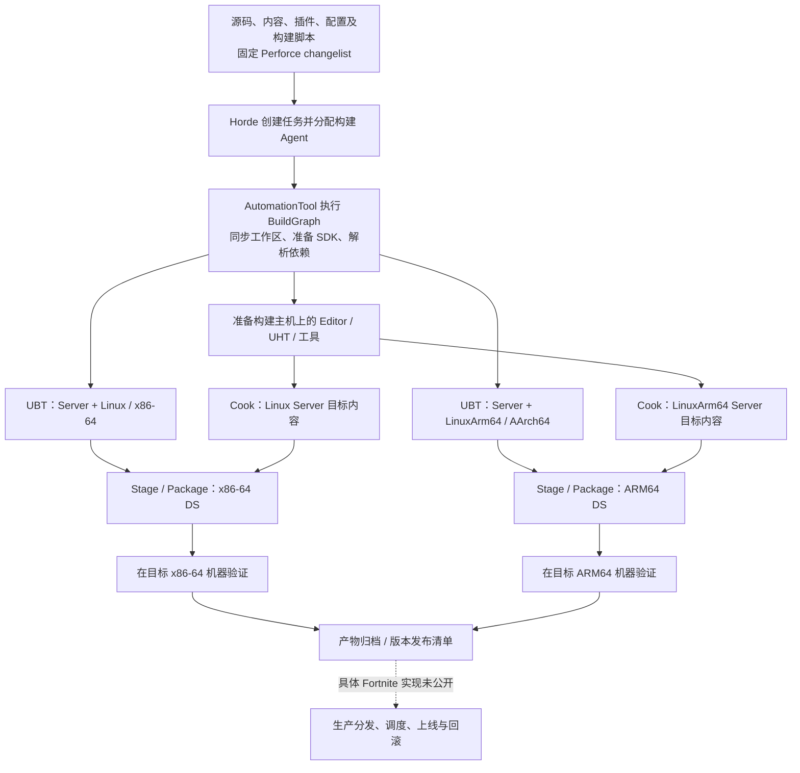

Fortnite DS 构建管线与多 CPU 架构产物调研
======================================

调研日期：2026-09-24。DS 指 Dedicated Server，即负责对局模拟的专用游戏服务器。

**结论：Epic 公开了足以理解其构建体系的工具、架构演讲和多架构实践，但本次未找到 Fortnite 生产 DS 的完整 BuildGraph XML、发布脚本或生产镜像定义。** 因此，下文区分三种证据：**实证**指明确谈到 Epic/Fortnite 的一手材料；**通用机制**指公开 UE 工具链的工作方式；**实现建议**指据此设计的可复用方案。不能把三者合并成一份声称“与 Epic 内部完全一致”的配置。

**1. 能确认的 Fortnite 实际情况**

| 事实 | 一手证据 | 边界 |
|---|---|---|
| Fortnite 使用 BuildGraph 进行构建及相关自动化 | [Epic BuildGraph 条目](https://dev.epicgames.com/documentation/unreal-engine/buildgraph) 明确点名 Fortnite | 没有公开其完整 DS 构建图 |
| Horde 是 Epic 开发 Fortnite、UE 等项目所用的基础设施 | [Epic Horde 文档](https://dev.epicgames.com/documentation/unreal-engine/horde-in-unreal-engine) | 不能据此断定每个功能都在每条 Fortnite DS 管线上启用 |
| 多数开发在 main，长周期工作可用 feature branch，到阶段切版本分支，RoboMerge 协调分支改动 | [2025-04-30 Epic 技术支持回复](https://forums.unrealengine.com/t/fortnite-p4-stream-structure-in-2025/2582920) | 精确的内容过滤和发布规则未完整公开 |
| Fortnite DS 同时运行在 x86-64 与 AArch64 上 | [Epic Pro Support 讨论中的 Alex Koumandarakis 回复](https://forums.unrealengine.com/t/what-aws-instance-types-do-fortnite-servers-use/2717160)，2026-03-23 | 回复未公开两种架构比例、完整实例列表和编译参数 |
| Epic 已长期使用 Graviton 承载 Fortnite 相关游戏业务 | [AWS 2024 中文技术文章](https://aws.amazon.com/cn/blogs/china/unreal-engine-5-dedicated-server-running-on-amazon-graviton-4/) | 文章后半部分用 Lyra 演示构建，不能视为 Fortnite 内部脚本 |
| Epic 的历史构建农场把 Perforce、缓存、临时产物存储与分布式编译结合起来 | [Epic 工程师主讲的 re:Invent 2021 GAM203 幻灯片](https://d1.awsstatic.com/events/reinvent/2021/How_Epic_Games_develops_Fortnite_faster_with_a_build_farm_on_AWS_GAM203.pdf)，PDF 第 35、37 页 | 是 2021 年的架构，包含 Incredibuild；不能直接等同于当前 Horde/UBA 部署 |

最新的 DS 架构回复还表示，Fortnite 通常在 Graviton 4 上获得最好性能，但不同项目的最佳选择会不同。这是运行性能信息，不能反推出每个 ARM 构建都用了某个特定优化选项。[Epic 回复](https://forums.unrealengine.com/t/what-aws-instance-types-do-fortnite-servers-use/2717160)

**2. 从源码到可运行 DS：能够从公开机制重建的完整流程**

下面是逻辑流程，不是泄露或复制的 Fortnite 内部构建图。Perforce/Horde/BuildGraph 属于有直接材料支持的 Epic 体系；具体节点名称、完整合并策略和上线门禁没有完整公开。



**步骤 A：固定输入版本。** 游戏与引擎代码、内容、插件和构建规则必须来自一致的版本集合。BuildGraph 官方说明，分布式执行时各 Agent 应同步同一个 changelist；不同节点之间可以交换中间产物。实际工程可把一次构建标识为“源码版本 + 引擎版本 + SDK 版本 + 目标 + 配置”。后者是追溯产物的实现建议。[BuildGraph 文档](https://dev.epicgames.com/documentation/en-us/unreal-engine/buildgraph-for-unreal-engine)

Fortnite 的分支实践有直接说明：2025 年的回复称，大多数工作和新功能在 main，长周期工作可能开 feature branch，并在某个阶段建立 `dev-fortnite-RELEASENUMBER` 分支，RoboMerge 协调 release branches 之间的改动。这能说明发布输入从哪里来，但未完整揭示如何过滤尚未发布的内容。[Fortnite P4 Stream Structure in 2025](https://forums.unrealengine.com/t/fortnite-p4-stream-structure-in-2025/2582920)

**步骤 B：调度与准备环境。** Horde 从模板创建任务，调度合适的 Agent，准备 Perforce 工作区并搬运节点输入输出；AutoSDK 可按主机条件分发和配置目标 SDK。BuildGraph 决定“哪些工作依赖哪些产物”，Horde 决定“在哪台机器执行”。编译加速是另外一层：Horde 可配合 UBA 分发编译工作，但公开支持这种能力不等于已确认 Fortnite 每个 DS 目标的具体加速配置。[Horde Build Automation](https://dev.epicgames.com/documentation/unreal-engine/horde-build-automation-for-unreal-engine)、[Horde 功能说明](https://dev.epicgames.com/documentation/unreal-engine/horde-in-unreal-engine)

**步骤 C：准备 Host 工具。** 这里必须区分构建主机与目标机器。Windows 构建节点使用 Windows 版 Editor/命令行工具执行 Cook，同时可以生成 Linux ARM64 DS。AWS 的 UE 5.4.3 演示正是先生成 Win64 Editor，再使用 v22 Linux 交叉工具链打包 LinuxArm64。匹配版本的 Editor/工具可以复用，不意味着每次都要全量重建一遍。[AWS Graviton 4 教程](https://aws.amazon.com/cn/blogs/china/unreal-engine-5-dedicated-server-running-on-amazon-graviton-4/)

**步骤 D：编译 Server Target。** UBT 读取项目的 `*.Target.cs` 和模块构建规则。DS 应是 `TargetType.Server`；Development/Shipping 是另一个配置维度。UBT 先调用 UHT 处理反射元数据并生成代码，再调用目标 C++ 编译器进行编译、链接。不要把普通客户端加一个无窗口启动参数等同于构建专用 Server Target。[UBT Targets](https://dev.epicgames.com/documentation/unreal-engine/unreal-engine-build-tool-target-reference)、[UHT](https://dev.epicgames.com/documentation/en-us/unreal-engine/unreal-header-tool-for-unreal-engine)

**步骤 E：Cook 服务端内容。** Cook 把工程资源转成目标平台可消费的形式。DS 仍需要对局相关资源和配置，例如地图与游戏逻辑所依赖的数据；具体保留和裁剪项由项目及平台规则决定。CPU 二进制编译完成不代表已得到可部署的完整 DS。Epic 的 DS 教程也把 Build 与 Cook 分成独立步骤。[DS 教程](https://dev.epicgames.com/documentation/en-us/unreal-engine/setting-up-dedicated-servers-in-unreal-engine)

**步骤 F：Stage、Package、Archive。** Stage 汇集可执行文件和内容，Package 形成平台分发形式。运行依赖也必须进入正确的位置；动态库一般要作为文件提供给系统加载。可按项目设置使用 Pak/IoStore 或其他内容布局。Archive/上传则把经过验证的版本保存到制品存储。这里的“包”不必是 Docker 镜像。[Build Operations](https://dev.epicgames.com/documentation/en-us/unreal-engine/build-operations-cooking-packaging-deploying-and-running-projects-in-unreal-engine)、[Third-Party Libraries](https://dev.epicgames.com/documentation/en-us/unreal-engine/third-party-libraries?application_version=4.27)、[项目打包设置](https://dev.epicgames.com/documentation/unreal-engine/project-section-of-the-unreal-engine-project-settings)

**步骤 G：验证与发布。** Horde 提供与 UAT/Gauntlet 集成的测试能力；Fortnite 的完整 DS 测试套件未公开。建议每个架构都验证启动、地图加载、客户端连接、对局、进程退出、崩溃符号解析，并测量 tick 延迟、内存与服务器承载密度。生产发布建议绑定不可变版本和架构产物，测试通过后再提升版本，保留上一版回滚入口。这些具体门禁是实现建议。[Horde 测试功能](https://dev.epicgames.com/documentation/unreal-engine/horde-in-unreal-engine)

还有一个已公开的历史验证回路：2020 年 Fortnite 白皮书描述了每 10 分钟增量编译 Editor、加载变更内容做检查、启动两个 Editor 分别以 `-game`/`-server` 运行，验证登录、匹配、入局以及移动/射击/建造/采集；另一台机器增量编译各目标平台，结果回填 UGS badges。这个回路用于快速发现开发问题，不能等同于最终打包 DS 的生产验收全流程。[官方白皮书，第 12 页](https://cdn2.unrealengine.com/workflow-on-fortnite-whitepaper-final-181633758.pdf)

**3. 不同 CPU 架构的最终产物如何生成**

构建参数至少有四个彼此独立的维度：

```text
Target：       MyGameServer
Platform：     Linux / LinuxArm64
Architecture： x86_64 / aarch64
Configuration：Development / Shipping 等
```

在上述 UE/Linux 教程使用的命名中，平台名本身已区分 Linux 与 LinuxArm64。架构在不同系统中名称不同：`x86_64` 与 `amd64` 通常指同一 64 位 x86 架构；`aarch64` 与 `arm64` 指这里讨论的 64 位 ARM 架构。不能把 Docker 的平台字符串直接当成 UBT 平台名。

| 构建项 | Linux x86-64 DS | Linux ARM64 DS |
|---|---|---|
| UE 目标平台名 | `Linux` | `LinuxArm64` |
| CPU 架构 | x86-64 | AArch64 |
| LLVM target triple 的典型形式 | `x86_64-unknown-linux-gnu` | `aarch64-unknown-linux-gnu` |
| 需要的依赖 | x86-64 静态库/动态库 | AArch64 静态库/动态库 |
| UE 示例包目录 | `LinuxServer` | `LinuxArm64Server` |
| 容器平台名（若使用容器） | `linux/amd64` | `linux/arm64` |

平台与产物目录可在 [AWS UE ARM64 教程](https://aws.amazon.com/blogs/gametech/compiling-unreal-engine-5-dedicated-servers-for-aws-graviton-ec2-instances/) 和 [AWS 双架构 Lyra 示例仓库](https://github.com/aws-samples/containerized-game-servers/tree/master/lyra) 对照；target triple 的作用见 [Clang 交叉编译文档](https://clang.llvm.org/docs/CrossCompilation.html)。表中的目录是示例约定，实际布局以所用 UE 分支的 staging 输出为准。

**3.1 同一构建农场可以交叉编译两套 DS**

Windows x64 构建机不需要先运行 ARM 版操作系统才能产出 ARM64 DS。其 Clang 进程运行在 Host 上，目标 triple、sysroot、头文件和库决定生成哪种机器码。UE Linux 原生工具链也强调使用固定 sysroot 维持运行兼容性。工具链必须与引擎分支匹配，不能把旧教程里的 v20 或 v22 无条件套到新版本。[Clang](https://clang.llvm.org/docs/CrossCompilation.html)、[Epic Linux Development Requirements](https://dev.epicgames.com/documentation/unreal-engine/linux-development-requirements-for-unreal-engine)

对一个具有 Server Target 的 UE C++ 工程，下面是 **UAT 自动化调用示意**，不是 Fortnite 命令，也未在用户工程执行验证。假定 Host Editor/工具已经就绪，项目已配置服务器地图和所需内容；配置、目标选择与参数应以该引擎版本的 Project Launcher 输出和 `BuildCookRun -Help` 为准。

```bat
REM Windows CMD：生成 Linux x86-64 Server 包
Engine\Build\BatchFiles\RunUAT.bat BuildCookRun ^
  -project="D:\Game\MyGame.uproject" ^
  -noP4 -unattended -server -noclient ^
  -serverplatform=Linux -serverconfig=Shipping ^
  -build -cook -stage -pak -package -archive ^
  -archivedirectory="D:\Artifacts\CL12345\linux-x86_64"

REM Windows CMD：生成 Linux ARM64 Server 包
Engine\Build\BatchFiles\RunUAT.bat BuildCookRun ^
  -project="D:\Game\MyGame.uproject" ^
  -noP4 -unattended -server -noclient ^
  -serverplatform=LinuxArm64 -serverconfig=Shipping ^
  -build -cook -stage -pak -package -archive ^
  -archivedirectory="D:\Artifacts\CL12345\linux-arm64"
```

这里用 `-noP4` 假定 CI 已完成源码同步，用 `Shipping` 展示一种产物配置；二者都不是对 Fortnite 内部设置的陈述。若项目有多个 Server Target，需要显式消除目标选择歧义。Epic 推荐通过 Project Launcher 生成准确的 UAT 命令行。[命令行说明](https://dev.epicgames.com/documentation/en-us/unreal-engine/build-operations-cooking-packaging-deploying-and-running-projects-in-unreal-engine)

规模化后，可把这个粗粒度调用拆成 BuildGraph 的编译、Cook、打包与测试节点，从而分别调度和重试。并行构建两架构时，建议使用隔离工作区或经过验证的独立中间/输出目录，避免自定义脚本覆盖彼此产物。

**3.2 最容易漏掉的是原生依赖**

ARM64 Server 的所有原生依赖也必须兼容 ARM64，包括项目插件中的预编译 `.a`、`.so`、崩溃上报组件和其他 SDK。将主程序改成 ARM64 后继续链接 x86 库不会得到可运行版本。UE 使用模块 `.build.cs` 配置第三方链接库和 `RuntimeDependencies`，因此需要按目标选择正确库文件，并把运行依赖带入最终包。[UE 第三方库机制](https://dev.epicgames.com/documentation/en-us/unreal-engine/third-party-libraries?application_version=4.27)

**3.3 Cook 结果能否共用，需要单独证明**

可以共用源内容，不等于所有 cooked 内容天然跨目标兼容。Cook 受引擎版本、目标平台、Server 规则、插件和资源序列化影响。稳妥的基线是对两平台分别请求 Cook/Stage；如果希望共用，则应比较实际分支的平台规则并验证输出兼容性，再做去重或缓存优化。本次没有找到 Fortnite 明确说明 Linux x86-64 与 ARM64 是否共用完整 cooked payload 的一手材料。

这里既不能断言“必须把所有资源重复烘焙两遍”，也不能断言“只换 executable 就行”；应让目标平台规则和实测决定。[Epic Cook/Package 机制](https://dev.epicgames.com/documentation/en-us/unreal-engine/build-operations-cooking-packaging-deploying-and-running-projects-in-unreal-engine)

**3.4 CPU 架构与 CPU 微架构是两层问题**

Intel 与 AMD 的 x86-64 CPU 可以使用同一个满足共同 ISA/ABI 要求的包；Graviton 的 AArch64 包则需要单独生成。在同一架构内，如果使用面向特定 CPU 的指令与优化选项，可能要继续细分产物兼容范围。

例如 AWS 的 Graviton 指南说明 CPU 调优参数，2024 UE 示例也演示了针对 Graviton 4 的 `-mcpu=neoverse-v2`。它说明“可以这样优化”，不能证明 Fortnite 实际采用了同样的 flags。LTO、PGO、CPU 特化也应按目标测试后决定。[AWS Graviton C/C++ 指南](https://github.com/aws/aws-graviton-getting-started/blob/main/c-c%2B%2B.md)、[AWS UE 示例](https://aws.amazon.com/cn/blogs/china/unreal-engine-5-dedicated-server-running-on-amazon-graviton-4/)

**4. 最终交付物应如何组织**

下面是实现建议中的逻辑制品布局，不是 Fortnite 真实目录，也不是 UE 默认输出的精确复制：

```text
release-CL12345/
  release-manifest.json         # 版本、目标、SDK、校验值、产物地址
  linux-x86_64/
    server-package/             # x86-64 可执行文件、依赖、内容、启动脚本
    symbols/                    # 与该二进制对应的符号
    test-results/
  linux-arm64/
    server-package/             # AArch64 可执行文件、依赖、内容、启动脚本
    symbols/
    test-results/
```

建议 manifest 至少记录 source changelist/commit、引擎版本、工具链版本、Target、Platform、Architecture、Configuration、内容版本、二进制/包哈希和符号关联标识。若生成了 CPU 特化版本，也要记录 CPU/ISA 基线。它让部署器可以按运行节点能力选择兼容产物，并追溯线上实例到底运行哪一版。

**如果使用容器**，先为两种架构各生成一套真正匹配的 DS 文件，再打包到对应架构的基础镜像中，最后将两镜像合并到一个多平台 image index/manifest list 下。拉取时选择对应 variant；这个机制不会把一份 x86 可执行文件变成 ARM 可执行文件。[Docker 官方多平台说明](https://docs.docker.com/build/building/multi-platform/)

```text
mygame-ds:release-CL12345
  ├── linux/amd64 → x86-64 DS image digest
  └── linux/arm64 → AArch64 DS image digest
```

对同为 `arm64` 但需要不同 CPU 特性的变体，建议进一步使用单独标签、部署元数据和调度约束；不能只依赖 amd64/arm64 两项选择完成所有 CPU 型号适配。

AWS 确实提供了 Lyra 的 CodePipeline/CodeBuild → 两种架构镜像 → ECR manifest → EKS 演示。但示例 README 明确要求先准备两套 server binaries and content，并说明已经预先构建了它们。因此不能把文中的 12 分钟 fresh build 当成 Fortnite 或 UE 从源码全量编译、Cook 的耗时。[AWS 演示文章](https://aws.amazon.com/blogs/gametech/fire-up-your-unreal-engine-based-game-on-all-graviton-cores/)、[示例 README](https://github.com/aws-samples/containerized-game-servers/tree/master/lyra)

**5. 本次不能从公开资料确认的内部细节**

- Fortnite DS 的完整 BuildGraph 节点、模板参数、当前触发频率和详细发布分支规则。
- 每个目标的构建主机 OS/CPU 以及当前使用的分布式编译器配置。
- x86-64 与 AArch64 的实际 toolchain/sysroot 版本、CPU flags、LTO/PGO 策略。
- 两种架构的 Cook 结果是否完全共用，以及符号、内容和运行包的实际拆分方式。
- 生产 DS 是否采用 Docker/OCI，以及实际 registry、调度平台、灰度门禁和回滚方案。

尤其不能从“Epic 使用 AWS/Kubernetes”推出“Fortnite DS 必然使用 EKS/Agones/GameLift”。2021 构建演讲讨论的 containerized builders 也是构建节点，不是游戏运行节点；当时材料还把数据搬运问题列为临时/容器化构建机的障碍。[GAM203，PDF 第 42、50 页](https://d1.awsstatic.com/events/reinvent/2021/How_Epic_Games_develops_Fortnite_faster_with_a_build_farm_on_AWS_GAM203.pdf)

**6. 适合借鉴到自有项目的方案**

采用“固定源码版本 + BuildGraph 目标矩阵 + 对应架构的编译/依赖/Cook/Stage + 两套目标机测试 + 不可变制品清单”作为基线。先得到可运行、可追溯的两套 DS，再选择归档包分发或多架构 OCI 分发。对性能敏感的 DS，在架构级兼容性验证完成后，再单独评估 Graviton 型号调优、LTO/PGO 和 Cook 去重。

这套方案的工具与产物分层有公开文档支持；最后的配置组合是本报告的工程建议，不应当作 Epic 内部实现的披露。
